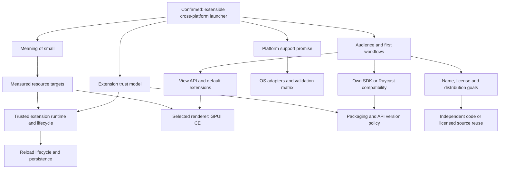

# Launcher design interview

**Reading guide:** this file records Pane's launcher-design interview, including recommendations that were later rejected or superseded. Use [current decisions](current-decisions.md) for reconciled Q1-Q41 status and [the handoff](HANDOFF.md) for the current phase. All 41 numbered entries are present, but this document is not a verbatim transcript. The pre-audit snapshot mentioned in earlier notes is absent from this repository.

## Ticket-review clarification: cross-platform contributors

2026-09-28: In response to a Windows-first ticket breakdown, the user said: "Make sure it works on other os too cuz devs in other os gonna join as well". Windows-only current evidence must not become a Windows-only development workflow. Require early native macOS/Linux builds and runs, portable contributor commands and native automated checks alongside Windows before expanding the shared extension system. Later platform installers and releases can still finish independently. The [accepted requirement](../.scratch/pane/contributor-platform-requirement.md) and [current ticket breakdown](../.scratch/pane/ticket-breakdown.md) record this clarification. No new platform validation has been performed; exact supported baselines remain to establish.

2026-09-28, subsequent ticket review: the user challenged whether the Matt skill had actually been followed. Revision 3 replaces bundled feature/validation tasks with narrower complete outcomes, moves unresolved decisions and release-wide evidence outside the implementation list, and explains each blocking edge. This is a planning correction, not acceptance of new product choices or approval to publish the revised tickets.

## Latest answers: Q36–Q41

**Follow-up, 2026-09-28:** User selects "like zed for now" for Q40 and requests automatic UI recovery for Q39 instead of requiring CLI entry. Adopt Zed-style licensing as the provisional direction: primarily GPL-3.0-or-later, with explicitly designated Apache-2.0 components considered separately. The exact component/SDK split remains open; no license files are applied during grilling. This permits compliant paid forks; it is not a no-sale restriction. For recovery, the accepted UX direction is automatic detection, skipping an identified failed extension, and a toast or similar explanation. Attribution and failure thresholds below remain design recommendations, not tested guarantees. This supersedes the CLI-first proposal and Q40's previously unresolved overall direction.

2026-09-28. These answers concluded the main grilling round. They were later reconciled in the continuity audit and carried into the Pane specification and ticket drafts. This section records that earlier discussion; current workflow status is in the handoff.

- **Q36 — Internet-first setup preference:** user prefers leaving the runtime/default-extension payloads out of the installer and assuming internet availability. Recommend a small installer/bootstrap that automatically acquires the compatible runtime helper and default feature packages, with progress/retry and local caching. No manual runtime/toolchain installation. This moves the initial download; it does not reduce installed runtime size or RAM. Exact download timing/packaging remains a proposal. Recovery/settings/download management must work without guest runtime activation. Requiring offline first use is not accepted.
- **Q37 — Staggered previews accepted, Windows-only evidence:** user agrees with staggered previews and emphasizes that testing currently covers Windows only. Windows is the current validated prototype platform; macOS/Linux remain intended targets, not verified support. No untested-platform release claim. Exact platform baselines remain open.
- **Q38 — User-initiated application updates:** notify users of available Pane updates (toast or similar); users choose whether/when to install. Do not infer automatic application downloads, installation or restart. Existing automatic compatible extension-update policy remains separate.
- **Q39 — Automatic UI recovery accepted as direction:** the initial CLI-first recovery proposal was superseded by the user's request to detect and skip the identified failing extension automatically and notify through a toast or similar UI. The detailed proposal follows below; thresholds, attribution and persistent retry behavior remain unvalidated.
- **Q40 — Zed-style licensing selected provisionally:** after the paid-fork/copyleft explanation, the user said "ok ig we go with like zed for now". Primarily GPL-3.0-or-later is the direction; exact SDK/component licensing and dependency review remain open. This permits compliant paid forks; no LICENSE file has been applied. See [license comparison](research/pane-license-options-q40.md).
- **Q41 — Name accepted: Pane.** Supersedes temporary Kyoko and earlier name proposals as the chosen product name. Existing directory and historical artifact names need not change during grilling. No trademark/domain/package availability claim is made.

### Proposed automatic recovery behavior for Q39

Start the GPUI shell, extension manager and recovery UI independently of extension execution. Track each managed activation/call by extension identity and runtime generation, with a small persistent failure record to prevent known startup crash loops. The earlier shared Wasmtime helper is a candidate, not an implemented crash boundary.

- Expected operation failures (offline service, invalid input) report an operation error; they do not automatically suspend the entire extension.
- An attributable fatal initialization failure skips that extension. Repeated attributable execution failures pause automatic activation/background work. The rest of Pane should remain usable.
- Show a toast such as "Weather was paused after an error" with Retry and Details/Manage actions, and preserve a persistent failure status in extension management after the toast disappears. Keep settings and saved data.
- Remember the failure across restarts so the same known broken startup is not blindly retried. An explicit retry or developer reload can attempt recovery; exact retry/update reset policy remains open. Distinguish failure-paused state from the user's persistent disabled preference.
- If the shared runtime process dies with several extensions active, a last-active record is only a diagnostic clue. Do not assert that one extension is responsible without attributable evidence. Recover the core UI, report that the extension runtime stopped, and offer UI recovery/retry while suppressing repeated automatic activation. Recovering the runtime must not automatically replay user actions with possible external side effects.
- A small startup marker can identify an interrupted startup, but cannot prove an extension caused it (power loss or forced termination can also interrupt startup). Offer recovery through the UI if attribution is uncertain. CLI diagnostics may exist for developers, but are not the normal recovery path.

This is a reliability design under the existing trusted-extension model, not guaranteed containment of arbitrary trusted code or a fix for crashes in Pane's own core. Cancellation, hangs, fatal shared-process crashes and persistent recovery behavior still need later validation. No new tests are requested by this discussion.

## QuickJS findings recorded; return to grilling

2026-09-28: User said "yk what lets just note it first, we are in grilling sesson". Resume design discussion and defer further coding/runtime experiments. No final QuickJS adoption, long-term fork, completed SDK or full application implementation is authorized by this checkpoint.

- QuickJS is an evaluated JS backend, not a requirement. Wasmtime executes components; WIT bindings alone do not execute JS. The tested JS component contains an engine; Rust compiles to a component without that JS engine.
- The temporary changes affect `componentize-qjs` integration, not the QuickJS engine source: remove the old preview1 adapter/reset import, link the P3 system library, remove P2 host registration during component initialization, and move the wrapper's async task pointer away from a context slot used by libc.
- Build requirements: pinned Rust nightly with source-built standard library, WASI SDK 34, `wasm32-wasip3`, and an explicit TLS metadata export. These are build-time requirements, not manual end-user runtime installations.
- Open defect: snapshotting repeats the initial `Math.random()` state across fresh instances. Reseeding remains unfinished. Concurrent operations, cancellation, long-run cleanup, actual guest hot reload, and macOS/Linux execution remain unverified.
- The patch is small, but ongoing integration maintenance is unresolved. Keep backend-specific details out of the proposed public SDK; replacement still requires compatibility validation. This is a recommendation, not a new user-approved engine decision.

Evidence: [source patch](research/qjs-p3-port-spike/runtime-port.patch), [test report and limitations](research/qjs-p3-port-spike/README.md). Remaining tests are deferred research work. Continue grilling from existing accepted decisions; do not reopen settled questions or ask the user to determine toolchain facts.

**Prototype checkpoint after Q34, updated 2026-09-28:** User said "keep testing". [Results](research/wasi03-validation.md) now include ordinary Rust std and a patched QuickJS JS/TS guest with P3-only imports, validated in a P3-only embedded host. Twenty same-instance async/library/file-stream calls and error cases pass. The temporary port adds size/memory cost and needs snapshot random-state initialization work. GPUI CE previously passed Windows guest-view rendering/JSON reload/click checks. No completed SDK, guest hot reload or non-Windows execution is inferred.

**WASI version requirement accepted:** user explicitly says "it has to be wasi3 btw, not wasi2". Target WASI 0.3; see [ADR 0013](adr/0013-require-wasi-03.md). Prior p2/synchronous tests remain historical and cannot prove this requirement. Q33 native-helper [comparison](research/native-helper-precedents-q33.md) is researched and Q33 is accepted in [ADR 0014](adr/0014-optional-native-extension-helpers.md).

Updated 2026-09-27. Workflow: user-invoked `/grill-with-docs`, which combines grilling and domain modeling.

## Confirmed intent

**Current runtime status:** the later WIT/Wasmtime reevaluation and explicit WASI3 requirement supersede treating Q18/Q19/Q23 Node/native execution choices as final. Wasmtime is the preferred candidate under validation; QuickJS has been tested with temporary patches and remains provisional. Further experiments are deferred. The user's "sounds good" after the library explanation did not establish universal library support or completed runtime validation.

- Build a general-purpose Raycast-like launcher with Pi-like extensibility.
- Support Windows, macOS, and Linux, with behavior as consistent as practical and explicit differences where necessary. Supported versions and Linux desktops remain open.
- Keep both the permanent feature core and resource usage small.
- Users should be able to install and author extensions.
- AI belongs in extensions rather than being a mandatory core feature.
- Initial default features: application launching, calculator, quicklinks, file search and optional clipboard history. Each can be disabled individually.
- Prioritize flexibility and reducing future architectural rework; this does not yet specify a trust model.
- Investigate hot reload and propose names.

The user chose Pi-style trust/distribution, the disable/data behavior below, JS/TS and Rust at launch, and GPUI CE with standard controls plus custom interactive views. Q18/Q19 Node/native entry-point choices below are historical, superseded by the WASI3 direction. Q40 provisionally selects Zed-style licensing; Q41 names Pane. Communication/UI contracts, OS versions, resource budgets and the exact SDK/license split remain open; unchanged third-party API compatibility is not promised.

## First-round answers

1. **Audience:** user describes a general-purpose Raycast-like product and asks for judgment. Recommendation: general-purpose daily utility, with extensibility designed for developers; avoid making programming a prerequisite for ordinary users.
2. **Platforms:** Windows, macOS and Linux confirmed. This does not settle identical feature parity, Linux desktop support, or a simultaneous release schedule.
3. **Small:** small feature core and low resource usage confirmed. AI should be an extension. Exact core/default-extension boundary and numerical budgets are not settled.
4. **Trust:** unanswered; user asks how Raycast does it. See [Raycast findings](research/raycast.md). Do not interpret this question as accepting Raycast's model.

## Second-round answers: questions 5-8

5. **Trust:** user is unsure and prioritizes flexibility to avoid extensive future changes. Trust remains unresolved. Recommendation: versioned host API and explicit lifecycle/process boundaries to reduce coupling; an initially trusted-code extension mode is a separate product choice. Do not infer authorization for unrestricted extension access from the flexibility preference.
6. **Default daily experience:** user accepts application launching, calculator, quicklinks, file search and optional clipboard history for now, and explicitly requires disable controls. Proposed disable behavior is to unload extension-owned resources and retain saved data; data retention and purge policy still need confirmation.
7. **Compatibility/distribution:** user asks how Raycast and Pi work before choosing. See [authoring and distribution comparison](research/extension-authoring-distribution.md). Own-SDK packages from external sources and unchanged Raycast extensions remain distinct options.
8. **Platform differences:** user accepts the proposed direction and asks for as much consistency as possible. Publish concrete differences; do not silently turn unavailable capabilities into apparent success.

## Accepted answers: questions 9-11

9. **Trust accepted:** user chose Pi and explicitly stated "HARDENING IS NOT A PRIORITY, PLUGIN CAPABILITY IS". Extensions are trusted local code with access to files, networking, subprocesses and native integrations, subject to OS/runtime support. This supersedes the conditional capability-sandbox recommendation in the research. See [ADR 0002](adr/0002-trusted-extensions-and-open-distribution.md).
10. **Distribution accepted:** user said "Do like pi" in response to own SDK and external installation. Adopt our own API with npm, Git and local sources; a reviewed central store is not required. This does not choose Pi's exact runtime/process layout or promise unchanged Pi/Raycast compatibility. The earlier built-artifact-only restriction is superseded.
11. **Disable semantics accepted:** user accepted reversible disable that stops host-managed work and retains unexpired data; separate cache/history deletion and uninstall; explicit choice about retained data on uninstall. Clipboard capture stops when disabled and retention deadlines continue. See [extension policies](extension-policy-proposal.md). Cleanup remains required for reliability under the trusted-code model; arbitrary external side effects are not reversible by the host.

Questions 9-11 are settled. Earlier unanswered trust/distribution entries above are interview history, superseded by these answers. Do not reopen hardening as a prerequisite to capability or treat runtime selection as already settled.

## New candidate: WIT / WebAssembly components

The user proposed `bytecodealliance/wit-bindgen` for extensions in JavaScript, Python, Rust, C# and other languages, and requested a trial plus resource-cost/catch analysis. This authorizes an exploratory smoke test, not final architecture adoption.

Completed: [feasibility and measured Windows smoke test](research/wasm-extension-feasibility.md), [language/toolchain audit](research/wasm-language-support.md). A Rust WIT component built and returned typed search results in Wasmtime. No JavaScript/Python/C# components or multi-platform host were built. The test does not settle resource budgets.

Following Q9-Q10, evaluate Wasm for interoperability and resource usage, not required sandboxing. It must justify any constraints on native libraries and integrations against the chosen capability-first priority. Language-neutral bindings do not provide unchanged Raycast/Pi compatibility.

12. **Language rollout accepted:** user accepted JS/TS first and immediately added "rust as well". JavaScript, TypeScript and Rust extension authoring are launch requirements; Python and C# can follow. This chooses authoring languages, not the host language, renderer, Rust transport or mandatory WIT/Wasm. Compare native-process and Wasm options against capability and resource goals.
13. **Extension UI and renderer accepted:** user said "lets do like pi doing" and explicitly selected `gpui-ce/gpui-ce`. Adopt standard controls plus custom interactive extension views, rendered through GPUI CE. Borrow Pi's extensibility pattern, not its terminal renderer. See [ADR 0003](adr/0003-gpui-ce-and-extensible-views.md), with [Raycast](research/raycast-extension-ui.md) and [Pi](research/pi-extension-ui.md) comparisons. The concrete JS/TS-to-GPUI interface, Rust extension transport, custom drawing contract and reload mechanics remain design work; a language-neutral view/event contract is a recommendation, not an implemented interface.

## Accepted reload behavior

14. **Hot reload accepted:** after the [Raycast](research/raycast-reload.md) and [Pi](research/pi-reload.md) comparison, user said "ok lets do that" to the concrete recommendation. Save triggers rebuild and reload of the affected extension, with manual reload available. Keep the GPUI CE host open; compilation failures preserve working code and show diagnostics. After successful compilation, clean up the old instance and start the replacement. Preserve saved data; temporary-state restoration requires explicit extension support. The same lifecycle applies to JS/TS and Rust. See [ADR 0004](adr/0004-reload-extensions-without-restarting-launcher.md). Q31 subsequently settles replacement startup failure as report/Retry/logs without automatic version rollback. Transport and detailed cleanup/migration recovery remain open; transparent live-state preservation was not promised.

## Accepted activation and installation behavior

15. **Activation and background work accepted:** user accepted the recommendation after the [comparison](research/extension-activation-setup.md). Use lazy command/event activation, scheduled work and explicit continuing background services. Disabled extensions stop managed work; installation alone does not require a permanently active instance. This is lifecycle management under full trust, not a sandbox policy. See [ADR 0005](adr/0005-lazy-activation-and-managed-dependencies.md).
16. **End-user setup accepted:** user accepted the recommendation and added that users should not need to install anything else to use it. The launcher manages required runtime/installation dependencies; ordinary supported extension packages require no manual Node/Rust/npm/Git/compiler installation. Support prebuilt Rust target packages if native execution is selected. Developer source builds can need toolchains. npm/Git/local distribution remains accepted; runtime, artifact formats and offline guarantees remain undecided. See [extension policies](extension-policy-proposal.md).

## Accepted search behavior

17. **Root search accepted:** user said "ok do it" to the concrete Raycast-style recommendation. Show apps, commands, quicklinks, calculator answers and enabled file results in root search. Search online service contents inside their selected commands, with aliases/hotkeys/fallbacks for access. Defer automatic searching across every online integration. Core owns search/navigation/aggregation; disableable extensions provide features and results. See [ADR 0006](adr/0006-raycast-style-search-with-extension-providers.md), grounded in [Raycast](research/raycast-root-search.md) and [Tinycast](research/tinycast-root-search.md) research. Exact provider SDK and ranking implementation remain open.

## Runtime decisions and remaining frontier

18. **JS/TS runtime accepted:** after the comparison, the user explicitly said "ok lets go with that". Adopt managed real Node; see [ADR 0008](adr/0008-managed-node-for-javascript-extensions.md). See [runtime compatibility research](research/node-runtime-compatibility.md) and [Pi/Tinycast source comparison](research/pi-tinycast-node-compatibility.md). Raycast uses managed Node; Pi uses Node for npm distribution and Bun in standalone builds; Tinycast implements a subset of Node behavior on JavaScriptCore. Use managed real Node as the JS/TS baseline, with npm/Node APIs and target-compatible native dependencies. This settles neither a runtime version nor process topology, and promises no universal npm compatibility. Trust was already accepted; Q18 concerns whether the runtime implements the APIs libraries expect. Q22 subsequently selects automatic Node download.

19. **Rust execution accepted:** after asking "how about rust then" and receiving the comparison, the user said "ok then" and requested a complete context handoff. Adopt native Rust helper processes with a first-class SDK and prebuilt target packages; see [ADR 0007](adr/0007-native-rust-extension-processes.md). [Execution options](research/rust-extension-execution.md) compare native helper processes, WIT/Wasm, host dynamic libraries and Node add-ons, supported by [Nushell/Zed precedents](research/rust-plugin-precedents.md). The accepted route uses on-demand native executables and managed prebuilt target packages, communicating directly with the launcher independently of Node. The shared launcher view/event contract still needs design. This preserves ordinary native library access and provides a reload boundary, with process/IPC/resource costs to measure. Q18 was subsequently accepted separately; both runtime routes are now settled.

GPUI CE findings are in [the source audit](research/gpui-ce.md). The [extension UI boundary proposal](research/gpui-extension-bridge.md) recommends host-owned GPUI objects and SDK view/event/drawing interfaces, but does not claim full GPUI parity or an implemented bridge. Renderer selection, managed Node and native Rust execution are settled; Q23 also settles the initial JS process arrangement; the concrete communication/UI protocol remains open.

## Current grilling round after the handoff

The user explicitly requested that grilling continue; the handoff was a checkpoint, not completion of the design session. Q18 and Q19 are accepted. The user supports Q20 and requests precedent research; Q21 is now accepted after the comparison; Q22 is accepted as Raycast-style managed runtime download. See [failure/update/setup research](research/extension-failures-updates-offline.md).

20. **Extension crashes, direction accepted with research requested:** user said "sounds good, lets try research others as well to make sure". Keep the launcher and other extensions usable, showing a clear error with Retry and logs, and pausing repeatedly failing background activation until the user retries. Saved data stays intact. No promise of automatic rollback or recovery from arbitrary trusted-code side effects. Exact retry thresholds remain implementation work.
21. **Extension updates accepted:** user said "ok do rec" to the revised recommendation after the comparison. Adopt automatic compatible updates for unpinned published packages, with global/per-extension opt-out and manual Update all. Pinned versions and local development folders are excluded; Git revision policy needs definition. This supersedes the earlier manual-first recommendation. Check declared host/platform compatibility and retain the previous code artifact where practical. Stage updates without replacing an active command mid-use; exact activation timing remains proposed. Code rollback is distinct from reversing a data migration. Host-application updates remain a separate question.
22. **Managed runtime download accepted:** after clarification, the user said "ok ig do like ray?". Use automatic acquisition/caching of the compatible Node runtime rather than bundling it in the normal installer. No manual runtime setup for users; first use of JS extensions can require network access and a download wait. This supersedes the earlier bundle-for-offline recommendation. Exact download timing, retry UI, default-extension artifacts and other dependency packaging remain implementation work. This selects our acquisition behavior; it does not claim inspection of current Raycast installers.

## Next grilling frontier

23. **JS process arrangement accepted:** after asking "what raycast and pi do?", the user said "ok lets just do rec for that". See [ADR 0009](adr/0009-shared-node-helper-with-extension-workers.md). See [the process comparison](research/extension-process-arrangements.md). Compare one shared Node helper with a worker per active JS extension against a separate Node process per active extension. Adopt one managed Node helper with a worker per active JS/TS extension, separate from the GPUI host, as the initial arrangement subject to prototype checks. Retain the documented shared-process crash impact. Worker/native-add-on compatibility must be checked and a separate-process exception may be needed; neither memory savings nor universal compatibility is established. Installed-but-unused extensions remain inactive. The shared-worker baseline is accepted; a separate-process exception is only a candidate if validation establishes a need.
24. **API compatibility direction accepted with correction:** user wants APIs to change as little as practical but explicitly allows breaking changes, and considers maintenance of abandoned extensions their authors' responsibility. Favor stability without indefinite compatibility or takeover obligations; see [ADR 0010](adr/0010-best-effort-extension-api-compatibility.md). This supersedes the proposed strict major-version compatibility guarantee. Exact versioning, deprecation periods, experimental labels and migration tooling remain open; do not infer those details were accepted.

25. **Extension composition accepted:** after the comparison and clarification that call-and-result resembles VS Code, the user said "ok". See [ADR 0011](adr/0011-extension-call-and-result-api.md). See [the comparison](research/extension-composition.md): Raycast command launching and a result-returning API are distinct; VS Code documents commands with returned results. Support calls to explicitly published commands with structured arguments/results across JS/TS and Rust, so a workflow extension can reuse another extension's functionality. The host resolves the target and reports unavailable/disabled/incompatible targets without silently re-enabling them. Command IDs, API/schema versioning, optional/required dependencies, cancellation and cycle handling remain design work. This is an accepted interoperability direction under full trust, not an access-control sandbox; no SDK has been implemented.

26. **Extension dependencies accepted:** after requesting the comparison, the user said "ok" to the recommended required/optional dependency behavior. See [dependency comparison](research/extension-dependencies.md). Authors declare required versus optional extension dependencies; show required dependencies in the installation summary and install compatible missing ones with the requested package. Do not install optional integrations automatically or re-enable a deliberately disabled dependency. Explain version/platform conflicts and unavailable features; do not silently replace pinned versions. This concerns dependencies on other launcher extensions, not ordinary npm libraries. Exact identity/source resolution remains open; Q27 subsequently selects dependent disable/removal behavior.

27. **Dependency disable/removal direction accepted:** user chose "prob do vscode" after the comparison. For A requiring B, show the affected required dependents and offer Disable All / Cancel or Uninstall All / Cancel. Confirmed disable explicitly disables the affected set; confirmed uninstall removes their code under the existing data-retention/deletion policy. Re-enabling or reinstalling B alone does not automatically restore A. This supersedes the proposed keep-installed-but-unavailable normal removal flow. See [comparison](research/dependency-disable-removal.md). This does not adopt unrelated VS Code behaviors such as automatically re-enabling dependencies during installation/calls. Optional integrations are not required dependents; graph traversal and UI details remain implementation work.

28. **Duplicate-ID rejection accepted:** following the responsibility clarification, user said "ye we can reject extension id tho". Reject a second installation declaring an already-installed extension ID with a clear already-installed error. Users/authors resolve conflicts; source switching, automatic settings merging and repair are not adopted. Ordinary updates remain updates to the tracked installation, not duplicate installs. Distinctly identified forks can coexist. Q29 subsequently selects Pi-style source identity; Q30 subsequently selects manual development-copy control.

29. **Pi-style source identity accepted:** after questioning developer-defined names and asking how Pi/Raycast/others work, the user said "ok do like pi". Identify npm packages by package name without version, Git packages by normalized repository host/path without ref, and local packages by resolved absolute path. Titles are separate; npm/Git/local copies can be distinct despite identical code. This supersedes both the proposed universal `author.extension-name` and generated UUID designs. Apply Q28 duplicate-install rejection to canonical source identity, retaining ordinary updates and no automatic source/data merging. Pi's personal/project precedence is not implicitly adopted. Package versus resource/operation addressing remains implementation/design work; Q30 subsequently selects manual development-copy control. See [ADR 0012](adr/0012-pi-style-source-identity.md) and [comparison](research/extension-identity.md).

30. **Manual development-copy control accepted:** user said "let devs do that, dont need to do this automatically". A local checkout and a published npm/Git installation remain independently enabled/disabled under the accepted source identity model. Developers disable or remove whichever copy they do not want running. Do not automatically replace, disable/restore or remap the published copy when starting/stopping development. Ordinary per-extension save/build/reload remains as accepted in Q14.

31. **Failure after replacement starts accepted:** after the [startup-failure comparison](research/extension-startup-failure.md), user said "ok go with that prob". Build failures preserve working code under Q14. If successfully built replacement code starts and fails during startup, clean up host-managed work, report the affected instance as failed and offer Retry/logs, without automatically reverting to the previous version. Normal developer save/build/reload can recover after a fix; retain prior suppression of repeatedly failing background activation. Preserve managed data; no automatic reversal of migrations or arbitrary side effects is promised. Exact cleanup and process-restart mechanics remain implementation work. VS Code host restart and installer transaction rollback are separate from this policy; Raycast's documented build-failure preservation is not a startup rollback guarantee.

32. **Historical-version picker deferred:** user said "ye right now its not needed" after the reliability objection and narrowed proposal. Defer automatic historical-version browsing and a dedicated downgrade picker from the initial release. Preserve accepted pin/update controls and source specifications; explicit supported version/commit inputs remain part of source-install design, without promising that every old revision has compatible artifacts. Local copies remain developer-managed. No automatic rollback/data restoration is adopted. Exact source-input UI/schema remains implementation work. See [comparison](research/manual-extension-version-recovery.md) and [discovery limits](research/extension-version-discovery.md).

**Runtime clarification after Q32:** user asks whether the plugin system is wit-bindgen plus a WASI runtime and whether that was researched. It was researched and a Rust component was run on Windows using wit-bindgen 0.62.0, wasm32-wasip2 and Wasmtime 49.0.1; [reproducible smoke test](research/wasm-spike/README.md). WASI defines interfaces; Wasmtime is the actual runtime tested. That experiment was not adoption or a full launcher benchmark. Q18/Q23 still select managed Node with extension workers for JS/TS; Q19 selects native Rust helper executables; GPUI CE renders the UI. WIT/Wasm remains optional future research, not the selected initial runtime. No runtime decision is reopened merely by this clarification request.

**Runtime decision reopened after Q32:** user clarifies "lets see if we can use those 2 instead, i thought we alr picking them". Evaluate wit-bindgen plus Wasmtime as the primary extension architecture, preserving GPUI CE and capability-first requirements. Earlier managed Node/native Rust execution decisions are under review, not a reason to dismiss the new direction. Prior Rust-only WASI smoke test is insufficient to claim JS/TS SDK or performance readiness; run a bounded JS/TS component evaluation and audit host APIs/native library implications. Acceptance of a completed design and any incompatible requirement changes must be explicit. Evaluation completed: [primary Wasmtime findings](research/wasm-primary-evaluation.md). TypeScript compiled through QuickJS and SpiderMonkey ran successfully in Wasmtime against the same WIT as Rust. Recommend continuing with Wasmtime as the primary candidate and QuickJS as the next JS prototype backend; full host APIs, GPUI integration, dependency compatibility, persistent resources and non-Windows execution remain unvalidated. No finished replacement architecture or full Node compatibility is implied.

## Current product frontier after the library clarification

Q33 and Q34 are accepted below; Q35 defers the catalog. Avoid asking the user to settle toolchain facts or performance claims that experiments must answer.

33. **Native helper escape hatch accepted:** after the Pi/Raycast/Zed comparison, the user said "hmm ok then". Allow optional OS/architecture-specific prebuilt helpers invoked through our SDK/host API for native libraries and OS functionality. The host manages execution and cleanup; supported packages need no normal-user compiler setup. WASI 0.3 remains required for the extension entry point. Exact bundled/download packaging and implementation mechanics remain open. See [ADR 0014](adr/0014-optional-native-extension-helpers.md).
34. **Platform-specific extension features accepted, with simplicity constraint:** user said "prov just go for rec if its not too complex" after the comparison. Allow authors to declare supported operating systems and use simple availability checks for individual actions, with a clear reason when unavailable. Preserve functioning actions and core Windows/macOS/Linux support. Keep the initial design to straightforward metadata and checks; no general compatibility-rule language or automatic platform porting is required. OS baselines/desktop coverage and exact SDK syntax remain implementation work. See [comparison](research/platform-specific-extensions-q34.md).
35. **Catalog deferred:** user said "no we gonna make everything works first, this can be considered later". Prioritize a functioning launcher and extension system; defer whether/when to build a browsable catalog. Existing npm/Git/local installation and default-feature decisions remain. This is not a commitment to a future catalog or a newly specified discovery UI.

Name/license and precise release support remain open. Representative library compatibility, GPUI custom-view feasibility, persistent runtime resource usage and reload cleanup are prototype work, not preference questions. This round does not declare the whole design complete or authorize full application implementation.

## Historical proposed round after the runtime checkpoint

2026-09-28: These were the questions/recommendations proposed before the Q36-Q41 answers at the top of this file. They are preserved as history, not pending questions or current decisions. In particular, offline bundling, automatic application downloads, permissive licensing and deferring the public name were not adopted as proposed.

36. **Offline first use:** should the installer include the embedded runtime and bundled default features so those local features work immediately offline? Recommend yes; third-party extension downloads and online integrations still need connectivity. Revisit the older Q22 Node-download choice in light of the WASI3 direction without silently carrying it over.
37. **Release readiness across platforms:** must the first public release wait for Windows/macOS/Linux together, or can previews ship as individual platforms become ready? Recommend staggered previews, with an explicit support matrix; keep all three as product requirements and choose exact OS/desktop baselines after platform auditing.
38. **Launcher application updates:** separately from accepted automatic extension updates, may the launcher automatically restart to apply its own update? Recommend automatic checks/downloads with user-controlled restart and an opt-out. API-breaking releases should explain known extension incompatibilities rather than silently interrupt work. Delivery mechanics remain implementation work.
39. **Startup recovery:** should users have a recovery launch mode that suppresses extension activation but permits management of installed packages? Recommend yes, including bundled feature extensions; preserve settings/data and allow disabling the broken package. This supports the accepted reliability direction, not a new trust boundary.
40. **License intent:** does the user want permissive reuse, or to require shared modifications under a reciprocal license? Recommend permissive open source for the host/SDK, subject to a separate dependency/source-license audit before selecting the exact license. Do not infer a legal license grant from this recommendation.
41. **Public name timing:** select a public name now or retain a temporary codename until core functionality works? Recommend defer public naming; Kyoko remains temporary, with no availability/uniqueness claim. Prior researched candidates are not accepted names.

## Decision tree

## Subsequent scenarios to resolve

- A user installs 50 extensions but uses two: how many runtimes stay alive?
- An extension responds after its query was cancelled or its code reloaded: which generation owns the result?
- An update changes required OS support or runtime dependencies: how is incompatibility shown before activation?
- A clipboard history extension runs on an unsupported Wayland desktop: should installation fail or should unavailable actions be explained?
- An extension requests a shell: does the product describe this as full local-code trust?
- A broken extension prevents normal startup: how does safe mode let the user remove it?
- A calculator or applications extension is removed: is an otherwise empty but working host an acceptable outcome?
- A third-party Raycast extension imports Node APIs or invokes AppleScript: how much compatibility is the project actually committing to maintain?
- A core update changes the extension API: pin, migrate, reject, or support multiple versions?
- A reload follows a storage migration: can the previous artifact still read the data?

## Documentation policy

Resolved domain terms belong in [CONTEXT.md](../CONTEXT.md). The [current decision index](current-decisions.md) records reconciled status; [the handoff](HANDOFF.md) records the active phase. This interview and the ADRs preserve Pane's reasoning and superseded choices. [Extension policies](extension-policy-proposal.md) describe Pane's intended extension behavior, and research/prototypes provide evidence with explicit limits. JS/TS and Rust remain launch authoring languages; WASI3 is required and QuickJS remains provisional. Earlier managed Node/native Rust baseline choices are historical. Concrete protocol and implementation remain undecided.
