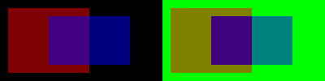
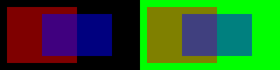

# Windows source-over renderer regression

Recorded 2026-10-02 for [Pane #63](https://github.com/hoangvu12/pane/issues/63).

- CE baseline: `17d9c8e8fdb30a329d817ca06bff424e8e848f1a`.
- Published fork: [2b9e644e3f89a38eacebc713fb0d1807c618c76c](https://github.com/hoangvu12/gpui-ce/commit/2b9e644e3f89a38eacebc713fb0d1807c618c76c).
- Zui reference: `ec16c62b83caa58b61cd8039db4b5721bacf948f`.
- Host: Windows 11 Pro 10.0.26200 x86_64; NVIDIA GeForce RTX 5050,
  driver 32.0.16.1074; Rust 1.98.1.
- Surface: hidden 200x100 Direct3D 11 swapchain, transparent clear; no presentation,
  focus, desktop input or desktop screenshot. Pixel coordinates are device pixels;
  this fixture does not depend on desktop DPI or transparency preferences.

| Renderer state | Quad overlap RGBA | Path overlap RGBA | Result |
| --- | --- | --- | --- |
| Original additive destination alpha | 64, 0, 127, 254 | 64, 0, 127, 254 | Both fail |
| Ordinary blend fixed only | 64, 0, 127, 191 | 64, 0, 127, 254 | Quad passes, path fails |
| Both blends fixed | 64, 0, 127, 191 | 64, 0, 127, 191 | Both pass; full library 15/15 |

`before`, `ordinary-only`, and `after` retain the emitted GPU readbacks
(`*-rgba.png`) and black/green composite previews (`*-preview.png`). The overlap
sample is at (80,50). Preview pixels come from measured premultiplied RGB plus
the background contribution; this is an alpha illustration, not a desktop-blur
capture. `tests.txt` retains the native test-runner output from each run, omitting
build progress and PowerShell's stderr redirection wrapper. `sha256.json` records
SHA-256 digests of those artifacts.




The initial attempt omitted CE's required `test-support` feature and failed to
compile its existing PlatformWindow readback implementation. Corrected command,
from the fork checkout (output path should be absolute when invoked elsewhere):

```powershell
$env:GPUI_ALPHA_OUTPUT_DIR = "$PWD/target/alpha-output"
cargo +1.98.1 test --locked -j1 -p gpui_ce_windows --features test-support --lib translucent_ -- --nocapture
cargo +1.98.1 test --locked -j1 -p gpui_ce_windows --features test-support --lib
```

Negative controls changed only the two production destination-alpha assignments
back to `D3D11_BLEND_ONE`, retaining the same tests. The ordinary-only control
retained `INV_SRC_ALPHA` for `create_blend_state` and `ONE` for
`create_blend_state_for_path_sprite`. Restoring both produced the published fork.
The unchanged source-over path-rasterization state and RGB blend states were
never modified. No test inspects blend constants.

See [dependency maintenance](../../gpui-fork.md) for the application pin and
update/retirement procedure. This result does not establish desktop blur, IME,
screen-reader behavior, or macOS/Linux runtime behavior.
